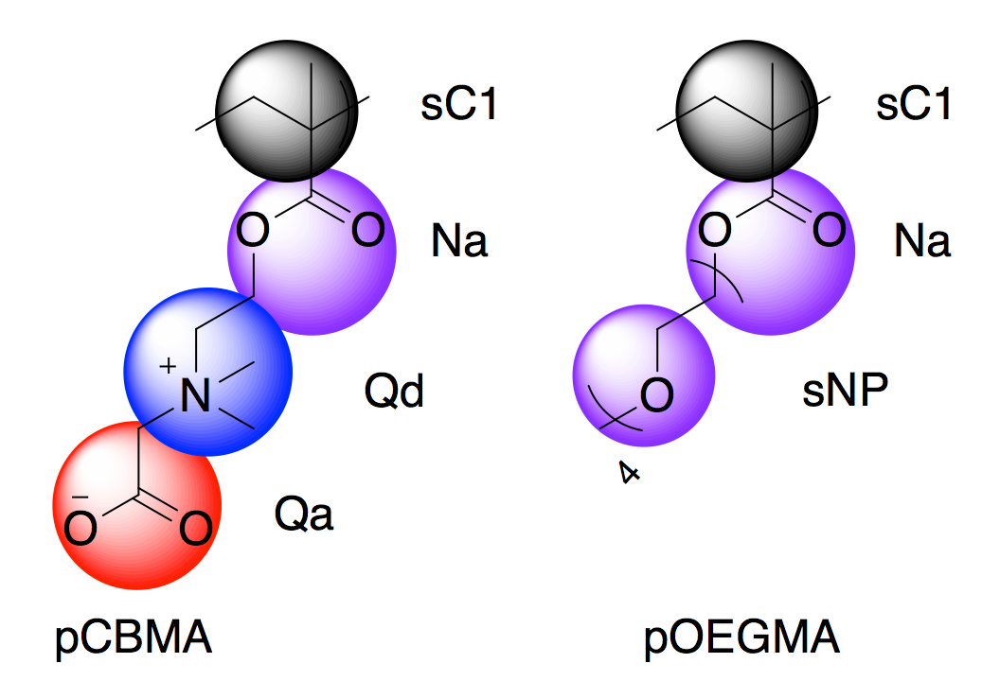

# polyTopBuilder
Topology/coordinate builder for protein-polymer conjugate CG models

This code was prepare to facilitate the study of the impact of polymer chemistry, and degree of polymerization on bioconjugate structure and function using the polymer CG models (Martini). However, the parameters for the CG model are arbitrary and for the sake of presentation. 

Usage:
* Construct the protein-multi-polymer conjugates Gromacs topology, coordinate and VMD friendly vtf topology.
* Visualize the coordinate/topology of protein conjugated with multiple polymers.
* This code works for any given protein from PDB, a list of conjugation sites where the polymer attached to the protein surface, and different types of branched polymers similar to zwitterionic poly(carboxybetaine methacrylate) (pCB or pCBMA), poly[oligo(ethylene glycol) methyl methacrylate] (pOEGMA). 
* Schematic representation of CG model is provided in the following. However minor modification might be required depending on the application.

