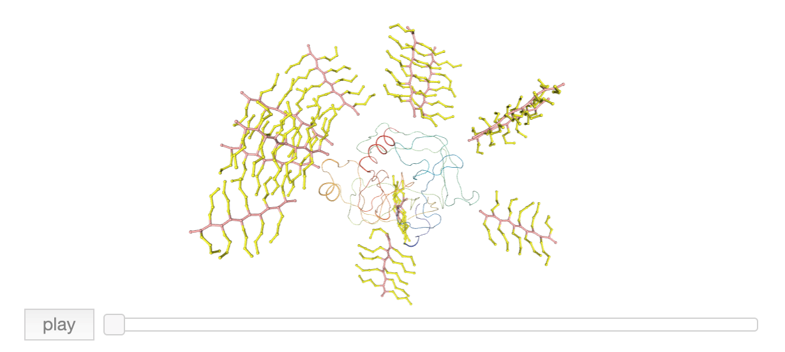

# polyTopBuilder
Topology/coordinate builder for protein-polymer conjugate coarse-grained models

This code was prepared to facilitate the model preparation to study of the impact of polymer chemistry, and degree of polymerization on bio-polymer conjugate structure and function using the polymer CG models similar to zwitterionic poly(carboxybetaine methacrylate) (pCB or pCBMA), poly[oligo(ethylene glycol) methyl methacrylate] (pOEGMA). However, the CG model parameters in this code are arbitrary and for the sake of presentation. 

Capabilities:
* Construct the Gromacs topology, coordinate and VMD friendly vtf topology for protein-multi-polymer conjugates.
* Visualize the coordinate/topology of protein conjugated with multiple polymers.

* This code works for any given Martini CG model of proteins from PDB, a customized list of conjugation sites where the polymer is attached to the protein surface, and different types of branched polymers. 
* Our [PEG CG model](https://github.com/farhadrgh/PEG_CG.git) parameters were used for the side chaines of pOEGMA.
* Schematic representation of pCBMA and pOEGMA CG models are provided in the following. However minor modification may be required depending on the application.

